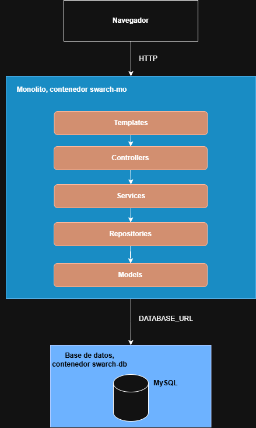

# Laboratorio 1 — Diseño Arquitectónico

**Nombre completo:** Raul Felipe Rodríguez Hernández

## Estructura del sistema

El sistema sigue una arquitectura monolítica compuesta por dos contenedores Docker: el monolito (`swarch-mo`), desarrollado en Python con Flask y organizado internamente en capas (`templates > controllers > services > repositories > models`), y la base de datos (`swarch-db`), que corre MySQL 8.0. La comunicación entre el navegador y el monolito se hace vía HTTP, mientras que el monolito se conecta a la base de datos a través de la variable de entorno `DATABASE_URL`.

## Propiedades del sistema

1. **Bajo acoplamiento entre la base de datos y el código**
Debido a que la base de datos y el código están en dos contenedores diferentes, comunicándose únicamente a través de la red (vía `DATABASE_URL`), es posible cambiar el motor de base de datos, escalarlo o moverlo a un host diferente sin tener que tocar el código del monolito en ningún momento.

2. **Separación de responsabilidades**
La arquitectura por capas utilizada en el sistema garantiza que cada uno de estos elementos tenga una única responsabilidad definida, facilitando así entender, modificar o reemplazar una capa sin afectar a otras de manera directa.

3. **Portabilidad sencilla**
El uso de Docker permite que el sistema sea portable a casi cualquier sistema operativo, o por lo menos los más comunes (Windows, Linux y macOS). Además, asegura que el proyecto se pueda trabajar en diferentes máquinas sin importar el entorno local de cada desarrollador.

4. **Consistencia transaccional**
Usar un motor de base de datos relacional como MySQL asegura que los principios ACID (Atomicidad, Consistencia, Aislamiento y Durabilidad) se cumplan en cada operación sobre los datos.

5. **Facilidad de desarrollo**
Flask es un framework de desarrollo bastante sencillo, fácil de usar y de entender, lo cual es importante en caso de que más personas se quisieran unir al equipo de desarrollo en el futuro.
